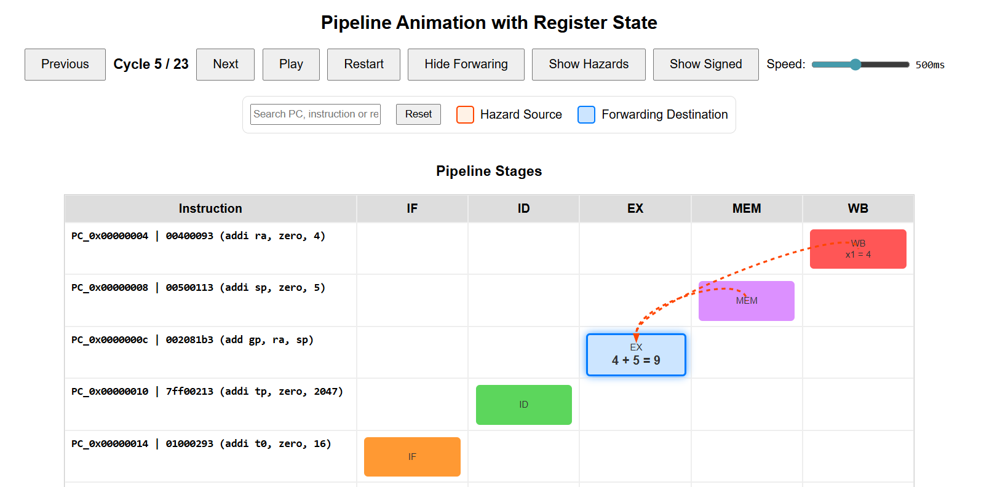

# RISC-V Pipeline Visualization Generator

An interactive HTML animation generator for visualizing RISC-V processor pipeline activity from VCD simulation files.



## ## Overview

This project provides Python scripts to generate interactive HTML visualizations of a RISC-V processor's activity. It reads a Value Change Dump (VCD) file from a hardware simulation, processes the signal data, and creates a self-contained webpage to visualize pipeline stages, register states, and data hazards for each clock cycle.

## ## Features

* **Interactive Animation:** A full pipeline animation with controls to play, pause, restart, and step through cycles.
* **Matrix View:** A static table-based visualization for a high-level overview of the entire execution trace.
* **Register State:** Tracks and displays the state of the register file at each cycle, highlighting changes.
* **Hazard Visualization:** Clearly shows data forwarding paths and pipeline stalls.

## ## Requirements

-   Python 3.x
-   `vcdvcd`, `capstone`, `pandas`

You can install the required libraries with pip:
```sh
pip install vcdvcd capstone pandas
```

## ## Usage

This repository contains several tools. Choose the one that fits your needs.

### ### 1. Pipelined Processor Animator (Task 4 & 5)

This script generates the full, interactive HTML animation. Check the vcd file to be in the same directory 

**Command:**
```sh
python riscv_pipeline_visualizer.py your_vcd_file.vcd
```
This will produce an output file named `pipeline_animation.html` and open it in your browser.

### ### 2. Pipeline Matrix Generator (Task 4 & 5)

This script generates a static HTML table showing the state of each instruction at every cycle. Check the vcd file to be in the same directory

**Command:**
```sh
python generate_pipeline_matrix.py your_vcd_file.vcd
```
This will produce an output file named `pipeline_matrix.html`.

### ### 3. Multi-Cycle Processor Visualizer (Task 3)

This script is specifically for visualizing a multi-cycle (non-pipelined) processor. Check the vcd file to be in the same directory

**Command:**
```sh
python multicycle_riscv_visualizer.py your_vcd_file.vcd
```
This will produce an output file named `multicycle_animation.html`.

## ## Configuration

If your VCD file uses different signal paths than the ones expected, you will need to edit the corresponding Python script. The signal path dictionaries (`stage_signals`, `instruction_signals`, etc.) are located at the top of each script.
