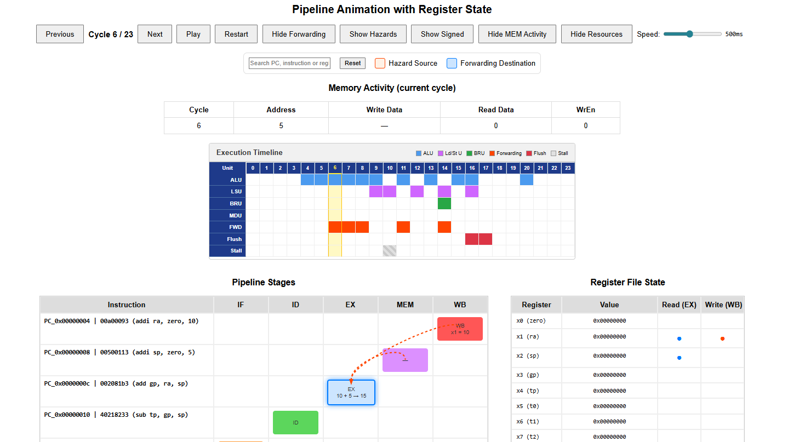

# RTL Pipeline Viewer – RISC-V Visualization Tool

An interactive **HTML-based visualization framework** for analyzing and debugging **RISC-V processor pipelines** using **VCD (Value Change Dump)** simulation traces.

This tool is designed to help **students and educators** understand how instructions flow through a processor, how hazards are resolved, and how control logic behaves at runtime.



---

## 🎯 Educational Goal

Modern RISC-V processors are complex, and debugging them using only waveforms can be difficult and time-consuming.  
This project bridges the gap between **RTL simulation** and **conceptual understanding** by transforming raw VCD traces into **clear, cycle-accurate visualizations**.

It helps answer questions like:

- Where is each instruction at every cycle?
- Why did the pipeline stall or flush?
- Where does forwarding happen?
- How do branches affect control flow?

---

## 👥 Target Audience

This repository is intended for:

- 🎓 **Students** in Computer Architecture / Digital Design courses  
- 🧪 **Teaching assistants** debugging student CPUs  
- 🔧 **Developers** implementing RISC-V cores in Chisel or Verilog  

No prior frontend or visualization knowledge is required.

---

##  Key Features

- ✅ **5-Stage Pipeline Visualization** (IF, ID, EX, MEM, WB)
- 🔄 **Cycle-by-cycle instruction tracking**
- 🧠 **Data hazard detection & forwarding paths**
- 🚦 **Control hazards (branches, jumps, flushes)**
- 📊 **Register file read/write visualization**
- 📦 **Load / Store activity display**
- 🌐 **Self-contained HTML output** (runs in any browser)
- 🔧 **Configurable signal mapping** via JSON

---

##  Supported Architectures

- ✔️ Pipelined RISC-V processors
- ✔️ Multi-cycle (FSM-based) RISC-V processors
- ✔️ Chisel + Verilator simulations
- ✔️ Any RTL that produces a valid VCD file

---

## 🚀 Quick Start

### 1️⃣ Requirements

- Python **3.8 or newer**
- A generated **VCD file** from your RTL simulation

Install dependencies:
```bash
pip install -r requirements.txt
```

---

### 2️⃣ Run the Pipeline Viewer

#### Option A – Interactive Mode (Recommended)
```bash
python run.py
```
The tool scans the `examples/` folder and lets you select a VCD file.

#### Option B – Direct Mode
```bash
python run.py examples/task5.vcd
```

The tool generates an HTML file and opens it automatically in your browser.

---

## 🧪 What You Will See

For every clock cycle, the visualization shows:

### 🔹 Pipeline Stages
- IF – Instruction Fetch  
- ID – Instruction Decode  
- EX – Execute  
- MEM – Memory Access  
- WB – Write Back  

### 🔹 Instruction Flow
- Instructions moving across stages over time
- Bubbles and killed instructions clearly marked

### 🔹 Hazards & Control
- 🔴 **Red arrows** → Data forwarding paths  
- 🟢 **Green arrows** → Taken branches / jumps  
- ⚪ **Flushes** → Killed instructions  
- ⏸️ **Stalls** → Pipeline pauses  

### 🔹 Register File
- Read and write ports highlighted
- Register values updated per cycle

---

## 📂 Repository Structure

```text
RTL-PipelineViewer/
│
├── run.py                     # Main entry point
├── requirements.txt           # Python dependencies
├── README.md                  # Documentation
│
├── src/                       # Core application logic
│   ├── main.py
│   ├── config.py
│   ├── vcd_reader.py
│   ├── simulation.py
│   └── html_view.py
│
├── tools/                     # Additional analysis tools
│   ├── generate_pipeline_matrix.py
│   └── multicycle_riscv_visualizer.py
│
├── configs/                   # Signal mapping configurations
│   ├── pipeline.json          # Default 5-stage pipeline mapping
│   └── ...
│
└── examples/                  # Example VCD files
    ├── task1.vcd
    └── ...
```

---

## 🛠️ Included Tools

### 1️⃣ Pipelined Processor Visualizer
```bash
python run.py <vcd_file>
```

Generates an **interactive animated pipeline view**.

Optional:
```bash
python run.py <vcd_file> -c configs/multicycle.json
```

---

### 2️⃣ Pipeline Matrix Generator
```bash
python tools/generate_pipeline_matrix.py <vcd_file>
```

Creates a **static HTML table** showing which instruction is in which stage per cycle.  
Useful for reports and quick debugging.

---

### 3️⃣ Multi-Cycle Processor Visualizer
```bash
python tools/multicycle_riscv_visualizer.py <vcd_file>
```

For **non-pipelined**, FSM-based RISC-V processors.

---

## ⚙️ Configuration System (Important for Students)

RTL designs use different signal names.  
This tool uses **JSON configuration files** to map your RTL signals to the visualizer.

### How to adapt it to your CPU:
1. Copy:
   ```bash
   cp configs/pipeline.json configs/my_cpu.json
   ```
2. Edit signal paths to match your Verilog/Chisel hierarchy
3. Run:
   ```bash
   python run.py my_trace.vcd -c configs/my_cpu.json
   ```

No Python changes required.

---

## 🎓 Academic Context

This project was developed to support **computer architecture education** and RISC-V RTL debugging.

**Author:** Joel Agustin Sanchez  
**Supervisor:** M. Sc. Tobias Jauch  
**Department:** Fachgebiet Entwurf Informationstechnischer Systeme (EIS)  
**University:** RPTU Kaiserslautern-Landau  

---

## 📜 License

This project is intended for **educational and research purposes**.

---

## 🙏 Acknowledgements

Inspired by RISC-V teaching laboratories and debugging workflows based on:
- Chisel
- Verilator
- GTKWave
