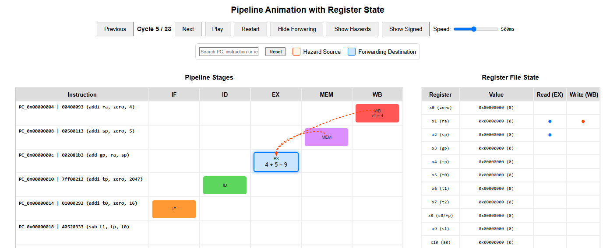
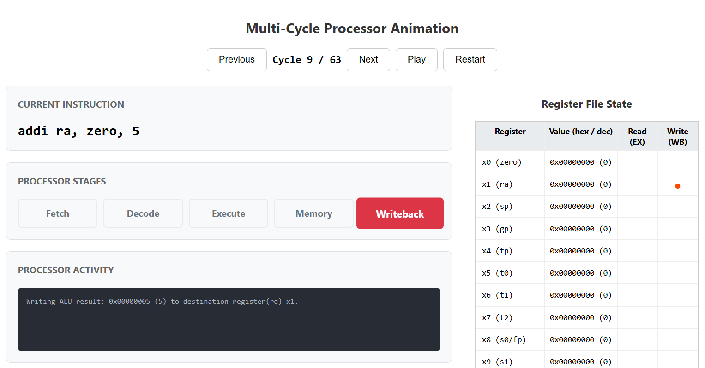

# RISC-V Pipeline Visualization Generator

An interactive **HTML visualization framework** for analyzing and debugging **RISC-V processor microarchitectures** using VCD (Value Change Dump) simulation traces.



*Supports pipelined and multi-cycle RISC-V processors, with both animated and static visualization modes.*

---

## 📌 Project Description

This project provides a set of **Python-based tools** to convert low-level **hardware simulation traces** into **human-readable, interactive visualizations**.

It is primarily intended for:
- understanding pipeline behavior,
- debugging control and data hazards,
- validating forwarding, stalls, and flush logic,
- and supporting **computer architecture education and research**.

The visualizer processes **VCD files** generated by simulators such as **Verilator** (commonly used with **Chisel**) and produces **self-contained HTML files** that run directly in a web browser.

---

##  Key Capabilities

The generated visualizations allow you to inspect, cycle by cycle:

- **Pipeline Stages:** IF, ID, EX, MEM, WB  
- **Instruction Flow:** Instruction movement across stages over time  
- **Register File Activity:**  
  - Read/write operations  
  - Value changes highlighted per cycle  
- **Data Hazards & Forwarding:**  
  - 🔴 Red arrows visualize data forwarding paths  
- **Control Hazards:**  
  - 🟢 Green curved arrows show taken branches and jumps  
- **Pipeline Control Events:**  
  - 🔴 Stalls (bubbles, waiting stages)  
  - ⚪ Flushes (killed instructions after control redirection)  
- **Memory Operations:**  
  - Load/store activity displayed in tabular form  

---

##  Features

- **Interactive HTML Animation**
  - Play, pause, restart, and step through cycles
- **Static Pipeline Matrix**
  - Compact overview of instruction vs. cycle vs. stage
- **Multi-Cycle Processor Support**
  - Visualization of non-pipelined (FSM-based) processors
- **Configurable Signal Mapping**
  - JSON-based abstraction layer for different VCD signal names
- **Robust Signal Detection**
  - Automatically matches alternative signal names for portability

---

##  Tools Included

### 1️⃣ Pipelined Processor Visualizer  
**Script:** `riscv_pipeline_visualizer.py`

Generates a **fully interactive HTML animation** for a 5-stage pipelined RISC-V processor.

```bash
python riscv_pipeline_visualizer.py your_vcd_file.vcd
```

Optional arguments:
```bash
-c, --config   JSON configuration file (default: pipeline_extension)
```

Examples:
```bash
python riscv_pipeline_visualizer.py task5.vcd
python riscv_pipeline_visualizer.py task5.vcd -c pipeline_base
python riscv_pipeline_visualizer.py task5.vcd -c pipeline_universal
```

Output:
- `pipeline_animation.html`

---

### 2️⃣ Pipeline Matrix Generator  
**Script:** `generate_pipeline_matrix.py`

Generates a **static HTML table** showing instruction progression across cycles.

```bash
python generate_pipeline_matrix.py your_vcd_file.vcd
```

Output:
- `pipeline_matrix.html`

---

### 3️⃣ Multi-Cycle Processor Visualizer  
**Script:** `multicycle_riscv_visualizer.py`

Visualizes **non-pipelined / multi-cycle** RISC-V processors.

```bash
python multicycle_riscv_visualizer.py your_vcd_file.vcd
```

Output:
- `multicycle_animation.html`



---

##  Configuration System

The visualization framework uses **JSON configuration files** located in the `configs/` directory to map hardware signal names to internal visualization signals.

- `pipeline.json` – Default mapping  

### Custom Configuration
To support a custom processor or naming scheme:
1. Create a new JSON file in `configs/`
2. Define mappings for pipeline stages, instructions, registers, and control signals
3. Run the visualizer with:
```bash
python riscv_pipeline_visualizer.py your.vcd -c my_custom_config
```

---

##  Requirements

- Python **3.x**
- Required libraries:
  - `vcdvcd`
  - `capstone`
  - `pandas`

Install dependencies:
```bash
pip install vcdvcd capstone pandas
```

---

## 📂 Repository Structure

```
.
├── riscv_pipeline_visualizer.py
├── generate_pipeline_matrix.py
├── multicycle_riscv_visualizer.py
├── configs/
│   ├── pipeline_extension.json
│   ├── pipeline_base.json
│   └── pipeline_universal.json
├── images/
│   ├── Pipiline_Visualization.png
│   └── Multistage_Visualization.png
```

---

## 🎓 Academic Context

This project was developed in an **academic setting** to support coursework and experimentation in **computer architecture and digital system design**, with a focus on **RISC-V processors**.

**Author:**  
Joel Agustin Sanchez  

**Supervisor:**  
M. Sc. Tobias Jauch  

**Department:**  
Fachgebiet Entwurf Informationstechnischer Systeme (EIS)

**University:**  
RPTU Kaiserslautern-Landau  


---

##  License

This project is intended for **educational and research purposes**.

---

## 🙌 Acknowledgements

Inspired by RISC-V teaching laboratories and debugging workflows based on **Chisel**, **Verilator**, and **GTKWave**.
