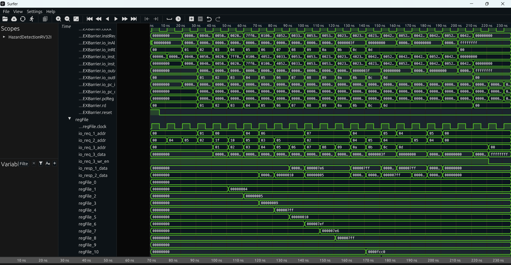
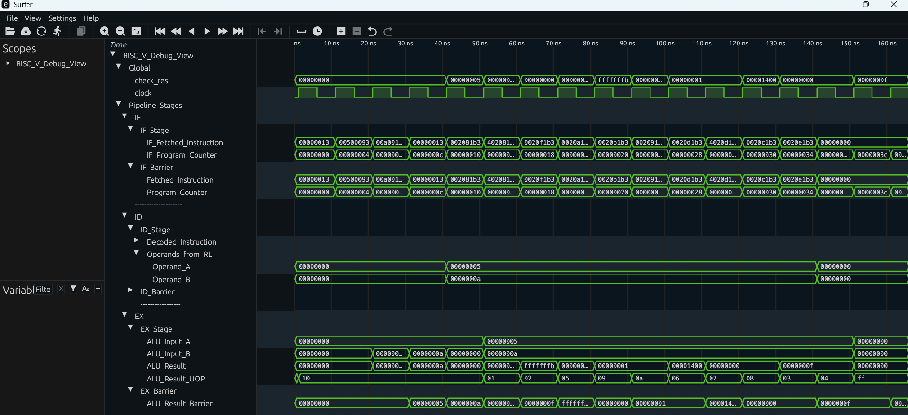

# RISC-V VCD Post-Processing & Visualization Toolkit

This toolkit provides a configurable pipeline to transform raw VCD (Value Change Dump) simulation outputs into compact, human-readable, and hierarchically organized waveform files for effective debugging.

---

## Overview

Raw VCDs from complex RTL simulations, such as RISC-V pipelines, are often impractically large and filled with cryptic, auto-generated signal names. This hinders efficient debugging.



> **Before:** A raw VCD file presents a flat, unfiltered list of thousands of signals, making analysis difficult.

This solution uses a Python script (`reorganize_vcd.py`) controlled by a YAML configuration file to post-process the raw VCD.  
The script filters, renames, and groups signals according to the YAML specification. It can also generate derived ASCII-based signals from numeric data (e.g., mapping micro-op codes to string mnemonics).

A provided Surfer script (`load_filtered_vcd.sucl`) then auto-loads this processed VCD into the viewer, automatically applying the complete signal hierarchy defined in the configuration.


> **After:** The processed VCD loads instantly with signals renamed and organized into logical groups (e.g., by pipeline stage).

---

## Core Components

- **`reorganize_vcd.py`** — The core Python processing engine.  
- **`config_task4.yaml` / `config_task5.yaml`** — Configuration files defining signal mappings for the `PipelinedRV32I` and `HazardDetectionRV32I` designs, respectively.  
- **`load_filtered_vcd.sucl`** — A Surfer script for automatic waveform loading and grouping.
- **`load_vcd_URL.sucl`** — A Surfer script for loading from **GitHub** (for the Browser App).

---

## Usage Workflow

### 1. Prerequisites

- Python 3  
- PyYAML library — install using:
  ```bash
  pip install pyyaml
  ```
- Surfer Waveform Viewer

---
### 2. Run VCD Processing

Execute the Python script from the command line, specifying the configuration, the raw input VCD and the desired output path. 

**Example (Task 5):**
```bash
python reorganize_vcd.py -c config_task5.yaml -i task5.vcd -o reorganized_output.vcd
```

**Example (Task 4):**
```bash
python reorganize_vcd.py -c config_task4.yaml -i task4.vcd -o reorganized_output.vcd
```

This generates the compact `reorganized.vcd` file.

---


### 3. Load in Surfer

Choose one of the two methods below.

#### Option A: Local Desktop App

This method is fast and ideal for local development.

1.  **Configure Local Script:** Edit the `load_vcd.sucl` file. Update the `load_file` command with the *local, absolute path* to the `reorganized.vcd` file you just created.

    **Example:**
    ```bash
    # This path MUST be absolute
    load_file C:/your/project/path/reorganized.vcd
    scope_add_as_group_recursive RISC_V_Debug_View
    zoom_fit
    ```

2.  **Run in Surfer:** Open the Surfer **desktop application**. Click `File > Run command file...` and select your local `load_vcd.sucl` file.
3.  The waveform will load instantly.

#### Option B: Browser App (via GitHub URL)

This method is perfect for sharing your results or accessing them from anywhere.

1.  **Push to GitHub:** After generating `reorganized.vcd` in Step 2, **commit and push** it to this GitHub repository.
2.  **Get VCD URL:** On GitHub, navigate to the `reorganized.vcd` file. Click the **"Raw"** button and copy the URL from your browser's address bar. It must be the public, raw URL (e.g., `https://raw.githubusercontent.com/...`).
3.  **Configure URL Script:** Edit the `load_vcd_URL.sucl` file. Update the `load_file_from_url` command with the URL you just copied.

    **Example:**
    ```bash
    # This URL MUST be the "Raw" file link
    load_file_from_url [https://raw.githubusercontent.com/RPTU-EIS/RTL-PipelineViewer/main/Surfer_Visualization/reorganized.vcd](https://raw.githubusercontent.com/RPTU-EIS/RTL-PipelineViewer/main/Surfer_Visualization/reorganized.vcd)
    scope_add_as_group_recursive RISC_V_Debug_View
    zoom_fit
    ```

4.  **Commit and Push** your changes to `load_vcd_URL.sucl`.
5.  **Run in Browser:** Open `app.surfer-project.org`.
    * Click `File > Run command file from URL...`
    * Paste the **raw URL for the `.sucl` file itself** (e.g., `https://raw.githubusercontent.com/RPTU-EIS/RTL-PipelineViewer/main/Surfer_Visualization/load_vcd_URL.sucl`).
    * Press OK. The script will load from the URL, which in turn will load the VCD from its URL.

## Configuration

To adapt this toolkit for a new project, you modify the YAML configuration file.

---

### Signal Mapping

The `groups` section defines the hierarchy. The script maps signals using **path** and **name**.

**Example YAML:**
```yaml
groups:
  - name: "RISC_V_Debug_View"  # Root group, must match the .sucl script
    subgroups:
      - name: "Pipeline_Stages"
        subgroups:
          - name: "EX"
            signals:
              - path: "HazardDetectionRV32I.core.EX.io_aluResult"
                name: "ALU_Result"
```

**Explanation:**
- `groups` / `subgroups`: Define the collapsible hierarchy in the waveform viewer.  
- `path`: The full, exact hierarchical path to the signal as defined in the raw VCD's header (e.g., `Module.submodule.signal_name`).  
- `name`: The new, human-readable name for the signal in the output waveform.

---

### Derived String Signals

The `derived_strings` section creates new ASCII signals based on the values of existing numeric signals.

**Example YAML:**
```yaml
derived_strings:
  - source_path: "HazardDetectionRV32I.core.ID.io_uop"  # Numeric source signal
    new_signal_name: "uop_ascii"                        # Name for new string signal
    string_width_chars: 8                               # 8 chars = 64 bits
```

**This configuration instructs the script to:**
1. Monitor the signal at `source_path`.  
2. Map its numeric value (e.g., `0x01`) to a string (e.g., `"ADD"`) using the `UOP_MAPPING` dictionary in `reorganize_vcd.py`.  
3. Generate a new 64-bit signal named `uop_ascii` that displays the corresponding string mnemonic.

**Example result:**  
The `uop_ascii` signal displays `"ADDI"` for a numeric value of `0x10`, synchronized with simulation time.

---

## Summary

This toolkit streamlines the debugging workflow by automatically restructuring VCD files for clarity and insight.  
Once configured, it allows hardware designers to move seamlessly from cryptic raw waveforms to structured, mnemonic-rich signal traces that mirror the logical design hierarchy.
